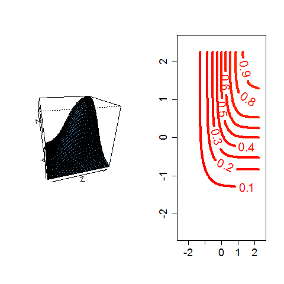

[](http://quantlet.de/)

## [](http://quantlet.de/) **BCS_NormalProbability** [](http://quantlet.de/)

```yaml


Name of Quantlet:             'BCS_NormalProbability'

Published in:                 'Basic Elements of Computational Statistics'

Description:                  'The code creates two graphics. One graphic is a scatterplot of
                               the bivariate normal cumulative distribution. Contours are plotted to
                               illustrate for which combinations of the two variables the
                               probability is the same. You can call them alo isolines.
                               The other plot is a 3 dimensional scatterplot, which shows
                               the specific value of the joint pdf.'

Keywords:                     'multivariate, distribution, normal, probability, cdf, contour, 
                               eigenvalues, standard, gaussian, copula, gaussian'

Author:                        Ostap Okhrin

Submitted:                    '2016-01-28, Christoph Schult'


Output:                       '3D-scatterplot for bivariate normal distribution and contour plot.'

```



### R Code
```r

# make sure the package is installed install.packages('fMultivar')
require(fMultivar)

# defines how the plots will appear
layout(matrix(c(1, 2), 1, 2))
# vector of random variable
x = (-45:45)/20
# produces X with columns x and y
X = grid2d(x)
# bivariate normal distribution for x and y
z = pnorm2d(X$x, X$y, rho = 0.7)
# produces matrix Z with three columns (x,y,z) z is the pdf of y and x
Z = list(x = x, y = x, z = matrix(z, ncol = length(x)))
# 3D scatterplot of bivariate normal pdf
persp(Z, theta = -15, phi = 25, col = "steelblue")
# contour plot of Z
contour(Z, xlim = c(-2.5, 2.5), ylim = c(-2.5, 2.5), lwd = 4, col = heat.colors(80), nlevels = 10, cex.axis = 1.5, labcex = 1.7)
```

automatically created on 2023-03-28