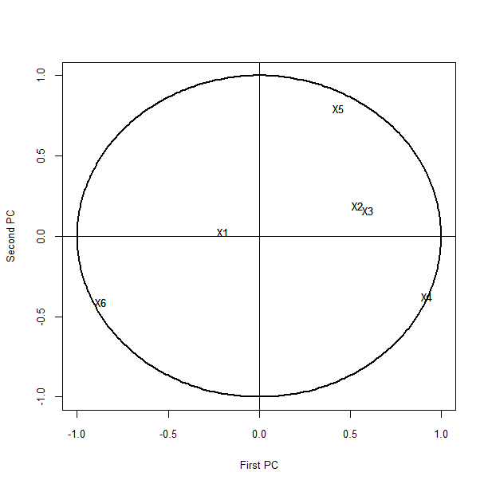

[](http://quantlet.de/)

## [](http://quantlet.de/) **BCS_PCAbiplot** [](http://quantlet.de/)

```yaml

Name of Quantlet:           'BCS_PCAbiplot'

Published in:               'Basic Elements of Computational Statistics'

Description:                'Perform normal principal component analysis (PCA) on the data "banknotes"
                             from package "ncomplete". Plot that correlation of the NPCs and the originial
                             variable including the unit circle in the plot for reference.'
              
Keywords:                   'normal, principal component analysis, banknotes, correlation, plot'

Author[New]:                 Johannes Haupt

Submitted:                  '2016-01-28, Christoph Schult'

Output:                     'Plot of the correlation between NPC and original variable on a unit circle.'


```



### R Code
```r


install.packages("ncomplete")  # install package to get the data
data(Banknotes, package = "ncomplete")  # load the data
mydata = Banknotes[, -ncol(Banknotes)]  # remove the last
# column indicating genuine/not genuine
fit = princomp(mydata)  # fit PCA model
print(summary(fit, loadings = TRUE), 2)  # display the result

dev.new()
ucircle = cbind(cos((0:360)/180 * pi), sin((0:360)/180 * pi))
plot(ucircle, type = "l", lty = "solid", xlab = "First PC", ylab = "Second PC", cex.lab = 0.8, cex.axis = 0.8, cex.main = 0.8, 
    lwd = 2)
abline(h = 0, v = 0)
label = c("X1", "X2", "X3", "X4", "X5", "X6")
text(cor(mydata, fit$scores), label, cex = 0.8)
text(cor(mydata, fit$scores), label, cex = 0.8)
```

automatically created on 2023-03-28