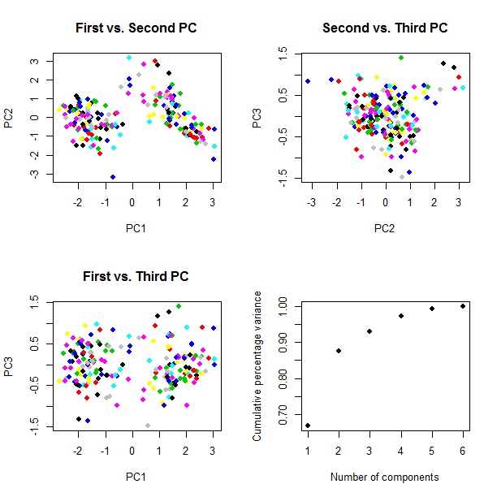

[](http://quantlet.de/index.php?p=info)

## [](http://quantlet.de/) **BCS_PCAvar** [](http://quantlet.de/d3/ia)

```yaml

Name of Quantlet : BCS_PCAvar

Published in : Basic Elements of Computational Statistics

Author[New] : Johannes Haupt

Description : 'Analysis of principal component analysis (PCA) in order to identify the efficient
number of principal components. The first three PCs are plotted against each other. Another plot
shows the cumulative percentage variance against the number of components.'

Keywords : dimension-reduction, pca, plot, principal-components, visualization

Submitted : 2016.02.06 Christoph Schult

```




```r
data(banknote, package = "mclust")  # load the data
mydata = banknote[, -ncol(banknote)] # remove the last column indicating genuine/not genuine
fit = princomp(mydata)  # fit PCA model
summary(fit, loadings = TRUE)  # display the result

dev.new()
layout(matrix(c(1, 2, 3, 4), 2, 2))  # 4 graphics in one plot
group = factor(banknote[, ncol(banknote)])  # the last column saved as factor
plot(fit$scores[, 1:2], col = group, pch = 19, ylab = "PC2", xlab = "PC1", main = "First vs. Second PC")  # plot 1 vs 2 factor
plot(fit$scores[, c(1, 3)], col = group, pch = 19, ylab = "PC3", xlab = "PC1", main = "First vs. Third PC")  # plot 1 vs 3 factor
plot(fit$scores[, 2:3], col = group, pch = 19, ylab = "PC3", xlab = "PC2", main = "Second vs. Third PC")  # plot 2 vs 3 factor
plot(cumsum(fit$sdev^2)/sum(fit$sdev^2), xlab = "Number of components", ylab = "Cumulative percentage variance", pch = 19)
# plot cumlulative explained variance vs number of PC
```
