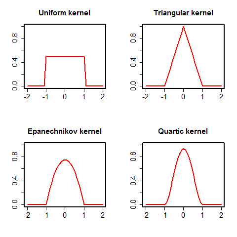

[](http://quantlet.de/index.php?p=info)

## [](http://quantlet.de/) **BCS_PopularKernels** [](http://quantlet.de/d3/ia)

```yaml

Name of Quantlet : BCS_PopularKernels

Published in : Basic Elements of Computational Statistics

Description : 'A function is implemented to use all four different kernel weighting functions to
compute the respective weight of a point x w.r.t. its distance to the point of evaluation x_0. Four
plots are created to illustrate each weighting functions and their properties.'

Keywords : 'kernel,bandwidth,weights,density estimation,plot,nonparametric, kernel density
estimation'

See also :

Author : [New] Christoph Schult

Submitted : 2016-01-28, Christoph Schult

Output : Four plots for the most popular kernel weighting functions.

```




```r
# The R function kernel.wfunc implements all different kernel weighting functions in R
kernel.wfunc = function(x, xzero, kernel) {
    n = length(x)  # number of points to evaluate
    y = NA  # weight vector
    dist = x - xzero  # distance vector
    for (i in 1:n) {
        if (dist[i] <= 1 & dist[i] >= -1) {
            # weights for each point x not to far from xzero uniform weights
            if (kernel == "Uniform") {
                y[i] = 0.5
            }
            if (kernel == "Triangular") {
                # triangular weights
                y[i] = 1 - abs(dist[i])
            }
            if (kernel == "Epanechnikov") {
                # Epanechnikov weights
                y[i] = 0.75 * (1 - dist[i]^2)
            }
            if (kernel == "Quartic") {
                # Quartic weights
                y[i] = 15/16 * (1 - dist[i]^2)^2
            }
        } else {
            y[i] = 0
        }  # weights for points too far from xzero
    }
    return(y)
}
kernel_names = c("Uniform", "Triangular", "Epanechnikov", "Quartic")
x = seq(-2, 2, by = 0.1)  # sequence for points to evaluate
par = par(mfrow = c(2, 2), cex.main = 1.5, lwd = 2, cex.axis = 1.5, lty = "solid")
for (i in 1:length(kernel_names)) {
    # loop creating the four plots
    y = kernel.wfunc(x, xzero = 0, kernel = kernel_names[i])
    plot(x, y, type = "l", xlim = c(-2, 2), ylim = c(0, 1), col = "red", xlab = "", ylab = "", main = paste(kernel_names[i], 
        "kernel"))
}
```
