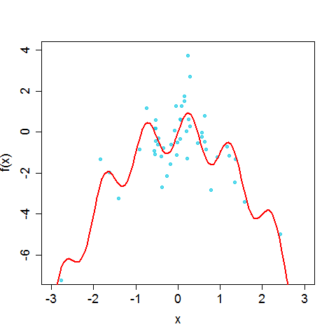

[](http://quantlet.de/)

## [](http://quantlet.de/) **BCS_RegressionCurve** [](http://quantlet.de/)

```yaml


Name of Quantlet:            'BCS_RegressionCurve'

Published in:                'Basic Elements of Computational Statistics'

Description:                 'The regression curve and data for a simulated model. The
                              variable Yis depends on Xis and a standard normally distrbuted'

Keywords:                    'regression, curve, regression curve, log-returns, estimation, plot, 
                              nonparametric, univariate nonparametric regression'

Author[New]:                  Christoph Schult

Submitted:                   '2016-01-28, Christoph Schult'


Output:                      'One plot for the simulated data and the regression curve.'

```



### R Code
```r

# load required packages
require(datasets)
require(class)
require(grDevices)
require(lattice)

# define regression model and create simulated data
n = 50
RegressionCurve = function(x) sin(2 * pi * x) - x^2
Xis = rnorm(n)
epsilon = rnorm(n)
Yis = sin(2 * pi * Xis) - Xis^2 + epsilon


# plot of the regression curve and data
plot(Xis, Yis, xlab = "x", ylab = "f(x)", xlim = c(-3, 3), ylim = c(-7, 4), cex = 1, cex.axis = 1.5, cex.lab = 1.5, cex.main = 1.5, 
    pch = 19, col = rgb(0.1, 0.8, 0.9, alpha = 0.7))
plot(RegressionCurve, add = TRUE, col = "red", xlim = c(-3, 3), type = "l", lwd = 2)
```

automatically created on 2023-03-27