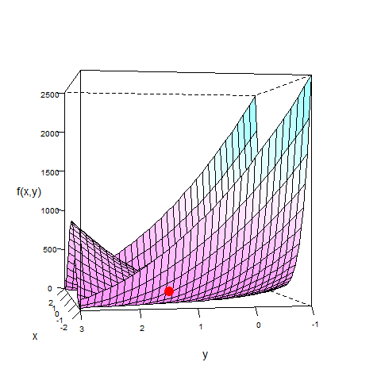

[](http://quantlet.de/index.php?p=info)

## [](http://quantlet.de/) **BCS_Rosenbrock** [](http://quantlet.de/d3/ia)

```yaml

Name of Quantlet : BCS_Rosenbrock

Published in : Basic Elements of Computational Statistics

Description : 'A 3d plot for the Rosenbrock function: z = 100*(y - x^2)^2 + (1 - y)^2. The minimum
(1, 1) is found by the Nelder Mead method.'

Keywords : 'Numerical optimization,optimization,3D,plot,multivariate, bivariate,BCS,numerical
methods,Rosenbrock,Nelder Mead method'

Author[New] : Christoph, Schult

Submitted : 2016-01-28, Christoph Schult

Output : A 3d plot of the Rosenbrock function.

```




```r
# load required packages
require(lattice)
require(neldermead)

# define Rosenbrock funcion to find minimum
fct = function(x) {
    y = 100 * (x[2] - x[1]^2)^2 + (1 - x[1])^2
}

# find minimum of the Rosenbrock function
answer = fminsearch(fun = fct, x0 = c(-1.2, 1), verbose = F)
pts = c(neldermead.get(answer, key = "xopt"), neldermead.get(answer, key = "fopt"))  # optimal function value

# grid for the surface plot
ng = 33  # number of grid
x = seq(-2, 2, length.out = ng)  # grid elements
y = seq(-1, 3, length.out = ng)

fhat = function(x, y) {
    v = numeric()
    v = (1 - x)^2 + 100 * (y - x^2)^2
    return(v)
}
mygrid = data.frame(expand.grid(x, y))
colnames(mygrid) = c("x", "y")
mygrid$z = fhat(mygrid$x, mygrid$y)

# grphical parameters
par.set = list(axis.line = list(col = "transparent"), clip = list(panel = "off"))
names(par.set) = c("axis.line", "clip")

# plot for the Rosenbrock function
wireframe(mygrid$z ~ mygrid$x * mygrid$y, pts = pts, aspect = 1, scales = list(col = "black", arrows = FALSE), drape = T, 
    colorkey = F, screen = list(z = 70, x = -90, y = 30), par.settings = par.set, xlab = list("x", cex = 1.2), ylab = list("y", 
        cex = 1.2), zlab = list("f(x,y)", cex = 1.2), panel.3d.wireframe = function(x, y, z, xlim, ylim, zlim, xlim.scaled, 
        ylim.scaled, zlim.scaled, pts, ...) {
        panel.3dwire(x = x, y = y, z = z, xlim = xlim, ylim = ylim, zlim = zlim, xlim.scaled = xlim.scaled, ylim.scaled = ylim.scaled, 
            zlim.scaled = zlim.scaled, ...)
        panel.3dscatter(x = pts[1], y = pts[2], z = pts[3], xlim = xlim, ylim = ylim, zlim = zlim, xlim.scaled = xlim.scaled, 
            ylim.scaled = ylim.scaled, zlim.scaled = zlim.scaled, type = "p", pch = 19, col = "red", cex = 2, .scale = TRUE, 
            ...)
    })
```
