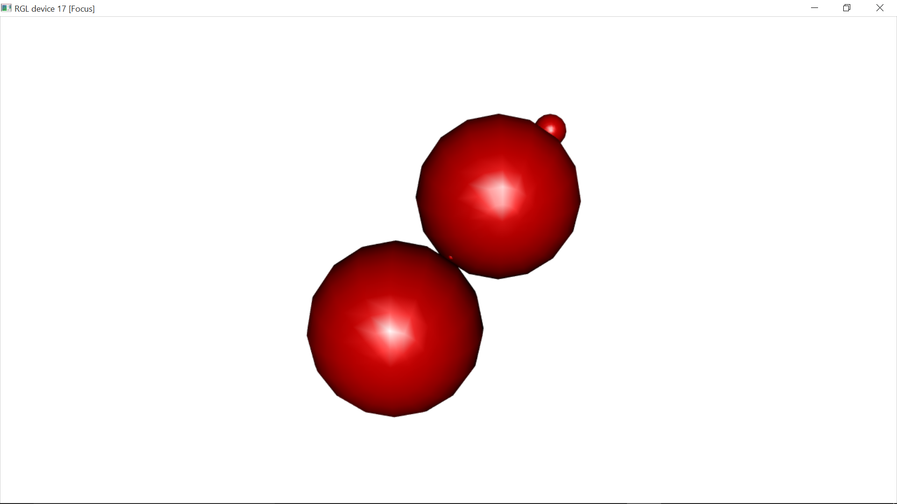

[](http://quantlet.de/)

## [](http://quantlet.de/) **BCS_SceneSelection** [](http://quantlet.de/)

```yaml

Name of Quantlet : BCS_SceneSelection

Published in : Basic Elements of Computational Statistics

Description : 'Three dimensional interactive plot for five spheres with coordiantes and radii
obtained by random sampling. It is possible to interactively select different scenes of the plot.'

Keywords : 'rgl, three dimensional, plot, three dimensional plot, scene selection, selection,
interactive'

Author : Polina Marchenko

Submitted : 2016-01-28, Christoph Schult

Output : One three dimensional plot for five spheres with the possibility to select scenes.

```




### R Code:
```r
require(rgl)  # load required package rgl
y = z = x = rnorm(5)  # coordinates for the mid points of the spheres
r = runif(5)  # radii for the different spheres
open3d()  # open 3D device
spheres3d(x, y, z, r, col = "red3")  # plots different spheres
rgl.select3d("left")
k = select3d()  # allows to select a region in an RGL scene
keep = k(x, y, z)  # applies the selection function to all coordinates
rgl.pop()  # clears all previous plots
spheres3d(x[keep], y[keep], z[keep], r[keep], col = "blue3")
spheres3d(x[!keep], y[!keep], z[!keep], r[!keep], col = "red3")
```
