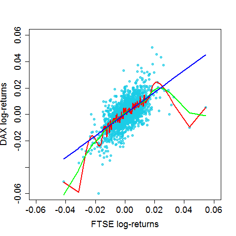

[](http://quantlet.de/)

## [](http://quantlet.de/) **BCS_Splines** [](http://quantlet.de/)

```yaml


Name of Quantlet:            'BCS_Splines'

Published in:                'Basic Elements of Computational Statistics'

Description:                 'Multiple spline regressions for DAX log-returns on FTSE
                              log-returns. The lambda is alternated to see the effect of
                              lambda for the regression results. The smootheness of
                              the regression line increases with a higher lambda. This
                              causes a smaller bias but a higher variance.'

Keywords:                    'splines, regression, DAX, FTSE, log-returns, estimation, plot, 
                              nonparametric, univariate nonparametric regression, lambda, 
                              different lambdas'

See also:                    'BCS_Splines'

Author[New]:                  Christoph Schult

Submitted:                   '2016-01-28, Christoph Schult'


Output:                      'One plot for multiple kernel regressions of the DAX log-returns on FTSE
                              log-returns. Different regression lines correspond to different
                              bandwiths.'

```



### R Code
```r

# load necessary packages
require(datasets)
require(class)
require(grDevices)
require(lattice)

# define log-returns for the DAX and FTSE indeces
r.dax = diff(log(EuStockMarkets[, 1]))
r.ftse = diff(log(EuStockMarkets[, 4]))

# estimated log-returns for the DAX index for different bandwidths
splines.reg.l1 = smooth.spline(x = r.ftse, y = r.dax, spar = 0.2)  # lambda = 0.2
splines.reg.l2 = smooth.spline(x = r.ftse, y = r.dax, spar = 1)  # lambda = 1
splines.reg.l3 = smooth.spline(x = r.ftse, y = r.dax, spar = 2)  # lambda = 2

# plot for the regression results
par(cex.axis = 1.5, cex.lab = 1.5, pch = 19, cex = 1)  # graphical parameters
plot(r.ftse, r.dax, xlim = c(-0.06, 0.06), ylim = c(-0.06, 0.06), xlab = "FTSE log-returns", ylab = "DAX log-returns", 
    col = rgb(0.1, 0.8, 0.9, alpha = 0.7))
lines(splines.reg.l1, col = "red", lwd = 2)  # regression line with lambda = 0.2
lines(splines.reg.l2, col = "green", lwd = 2)  # regression line with lambda = 1
lines(splines.reg.l3, col = "blue", lwd = 2)  # regression line with lambda = 2
```

automatically created on 2023-03-27