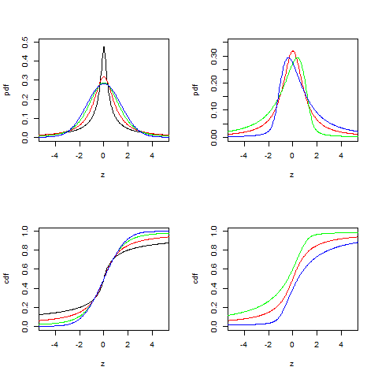

[](http://quantlet.de/)

## [](http://quantlet.de/) **BCS_StablePdfCdf** [](http://quantlet.de/)

```yaml


Name of Quantlet:              'BCS_StablePdfCdf'

Published in:                  'Basic Elements of Computational Statistics'

Description:                   'A stable distribution can be linearly transformed and stays
                                a stable distribtuion. The location and scale parameter for
                                the plots are identical. Only the skewness and kurtosis
                                varies among the graphs. If beta, the skewness parameter, is
                                smaller than zero, the distribuion is skewed to the left.
                                Therefore smaller values of the rv are more likely. If beta is
                                greater than zero, the opposite is true. Alpha determines the
                                kurtosis of the distribution. Higher values lead
                                to thicker tails and therefore values far from the mean
                                are more likely.'

Keywords:                      'univariate, distribution, stable, pdf, continuous, skewness, tail,
                                kurtosis, two, random, variable, transformation, linear, parameter,
                                characteristic, function'

See also:                      'BCS_StablePdfCdfSpecial, BCS_ExpPdfCdf,
                                BCS_NormPdfCdf, BCS_ChiPdfCdf,
                                BCS_FPdfCdf, BCS_CauchyPdfCdf, BCS_tPdfCdf'

Author:                         Ivan Vasylchenko, Benjamin Samulowski, Noa Tamir

Submitted:                     '2016-01-28, Christoph Schult'


Output:                        'Plots pdfs and cdfs for a stable distribution with different
                                parameters.'

```



### R Code
```r

# make sure both packages are installed

library(stabledist)
library(fBasics)
par(mfrow = c(2, 2))
z = seq(-6, 6, length = 300)

# thickness of tails
alpha = c(0.6, 1, 1.5, 2)
# skewness
beta = 0
# standard deviation
sigma = 1
# expectation
mu = 0

# stable pdfs for different tails (left side)
plot(z, dstable(z, alpha[1], beta, sigma, mu, 1), type = "l", xlim = c(-5, 5), ylim = c(0, 0.5), xlab = "z", ylab = "pdf")
lines(z, dstable(z, alpha[2], beta, sigma, mu, 1), col = "red")
lines(z, dstable(z, alpha[3], beta, sigma, mu, 1), col = "green")
lines(z, dstable(z, alpha[4], beta, sigma, mu, 1), col = "blue")


alpha = 1
beta = c(0, -0.8, 0.8)

# differently skewed stable pdfs (right side)
plot(z, dstable(z, alpha, beta[1], sigma, mu, 1), col = "red", type = "l", xlim = c(-5, 5), ylim = c(0, 0.35), xlab = "z", 
    ylab = "pdf")
lines(z, dstable(z, alpha, beta[2], sigma, mu, 1), col = "green")
lines(z, dstable(z, alpha, beta[3], sigma, mu, 1), col = "blue")


z = seq(-6, 6, length = 300)

alpha = c(0.6, 1, 1.5, 2)
beta = 0

# stable cdfs for different tails (left side)
plot(z, pstable(z, alpha[1], beta, sigma, mu, 1), type = "l", xlim = c(-5, 5), ylim = c(0, 1), xlab = "z", ylab = "cdf")
lines(z, pstable(z, alpha[2], beta, sigma, mu, 1), col = "red")
lines(z, pstable(z, alpha[3], beta, sigma, mu, 1), col = "green")
lines(z, pstable(z, alpha[4], beta, sigma, mu, 1), col = "blue")


alpha = 1
beta = c(0, -0.8, 0.8)

# differently skewed stable cdfs (right side)
plot(z, pstable(z, alpha, beta[1], sigma, mu, 1), col = "red", type = "l", xlim = c(-5, 5), ylim = c(0, 1), xlab = "z", 
    ylab = "cdf")
lines(z, pstable(z, alpha, beta[2], sigma, mu, 1), col = "green")
lines(z, pstable(z, alpha, beta[3], sigma, mu, 1), col = "blue")
```

automatically created on 2023-03-27