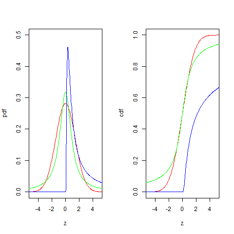

[](http://quantlet.de/index.php?p=info)

## [](http://quantlet.de/) **BCS_StablePdfCdfSpecial** [](http://quantlet.de/d3/ia)

```yaml

Name of Quantlet : BCS_StablePdfCdfSpecial

Published in : Basic Elements of Computational Statistics

Description : 'The code below plots the pdfs and cdfs for three special cases of the stable
distribution for which the pdf and cdf have a closed form expression. The special cases are the
normal, Cauchy and Levy distribution. Normal distributions have a kurtosis of three and zero
skewness. The Cauchy distribution is symmetric around its mean but has thicker tails than the
normal distribution. Random variables with a Levy distribution have a skewness which tends to one.
Only variables which are above the mean will be observed.'

Keywords : 'univariate,distribution,stable,pdf,cdf,continuous,gaussian,
gaussian,cauchy,levy,normal,lorenz'

See also : 'BCS_StablePdfCdf, BCSExpPdfCdf, BCS_NormPdfCdf, BCS_ChiPdfCdf, BCS_FPdfCdf,
BCS_CauchyPdfCdf, BCS_tPdfCdf'

Author : Ivan Vasylchenko, Benjamin Samulowski, Noa Tamir

Submitted : 2016-01-28, Christoph Schult

Output : Plots pdfs and cdfs for special stable distribution with different parameters.

```




```r
require(stabledist)
par(mfrow = c(1, 2))

z = seq(-6, 6, length = 300)

# mu and sigma are 1 and 0 Gaussian
n = c(2, 0, 1, 0)
# Cauchy
ch = c(1, 0, 1, 0)
# Levy
l = c(0.5, 0.9999, 1, 0)

# Gaussian pdf
plot(z, dstable(z, n[1], n[2], n[3], n[4], 1), col = "red", type = "l", xlim = c(-5, 5), ylim = c(0, 0.5), xlab = "z", 
    ylab = "pdf")
# Cauchy pdf
lines(z, dstable(z, ch[1], ch[2], ch[3], ch[4], 1), col = "green")
# Levy pdf
lines(z, dstable(z, l[1], l[2], l[3], l[4], 1), col = "blue")

# Gaussian cdf
plot(z, pstable(z, n[1], n[2], n[3], n[4], 1), col = "red", type = "l", xlim = c(-5, 5), ylim = c(0, 1), xlab = "z", 
    ylab = "cdf")
# Cauchy cdf
lines(z, pstable(z, ch[1], ch[2], ch[3], ch[4], 1), col = "green")
# Levy cdf
lines(z, pstable(z, l[1], l[2], l[3], l[4], 1), col = "blue") 
```
