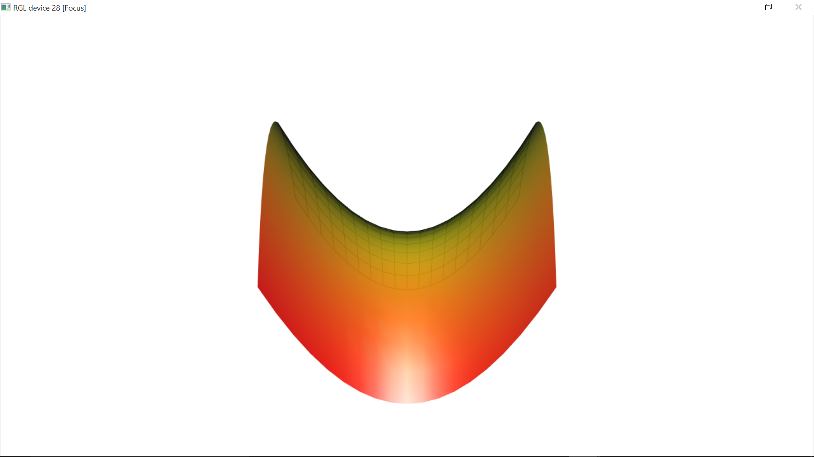

[](http://quantlet.de/index.php?p=info)

## [](http://quantlet.de/) **BCS_SurfaceShape** [](http://quantlet.de/d3/ia)

```yaml

Name of Quantlet : BCS_SurfaceShape

Published in : Basic Elements of Computational Statistics

Description : 'Three dimensional interactive surface plot with different front and back drawing for
the multivariate function z = 0.1 * (x^2 - y^2). The front is drawn by a solid colour and the back
with lines.'

Keywords : rgl,surface,plot,multivariate,continuous, 3D plot,scatterplot, hyperplane

Author : Polina Marchenko

Submitted : 2016-01-28, Christoph Schult

Output : 'An interactive surface plot with different drawings for the back and front for the
multivariate function z = 0.1 * (x^2 - y^2).'

```




```r
# surface3d
x = y = seq(-9, 9)  # define coordinates for the x and y axes
f = function(x, y) (x^2 - y^2)/10  # defines the function to compute the z values depending on x and y
z = outer(x, y, f)  # compute the z values for the grid of x and y
open3d()  # open 3D device
surface3d(x, y, z, back = "lines", col = rainbow(1000), alpha = 0.9)  # define color and transparency level
```
