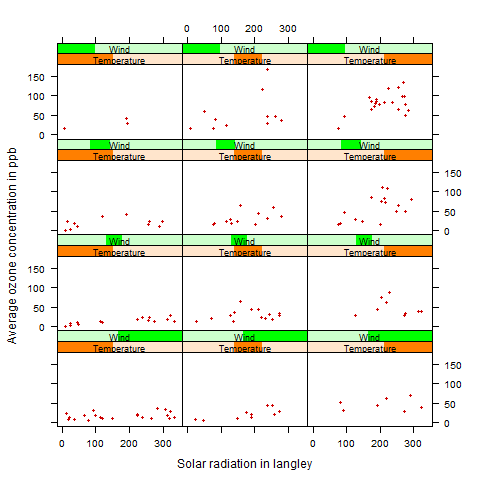

[](http://quantlet.de/)

## [](http://quantlet.de/) **BCS_TwoConditioningVariables** [](http://quantlet.de/)

```yaml


Name of Quantlet:            'BCS_TwoConditioningVariables'

Published in:                'Basic Elements of Computational Statistics'

Description:                 'The distribution of solar radiation and average ozone
                              concentration depending on wind and temperature is depicted in
                              the plot. The two continous conditioning variables are
                              transformed into factors. Wind has now just four categories
                              and Temeperature three. There are 12 possible combination of
                              both factors coinciding with the number of panels.'

Keywords:                    'trellis, lattice, conditional, panel, plot, panels, multivariate,
                              data, continuous, shingle, conditional continuous variable'

Author:                       Polina Marchenko

Submitted:                   '2016-01-28, Christoph Schult'


Output:                      'One plot with 12 panels for average ozone concentration and solar
                              radiation conditional on temperature and wind.'

```



### R Code
```r

# make sure the package is installed install.packages('lattice')
require("lattice")

# Conditional plot with two conditioning variables

# factorizing temperature into three categories
Temperature = equal.count(environmental$temperature, number = 3, overlap = 0)
# factorizing wind into four categories
Wind = equal.count(environmental$wind, number = 4, overlap = 0)

# plot with 12 panels for the two conditioning variables
xyplot(ozone ~ radiation | Temperature * Wind, data = environmental, as.table = T, par.strip.text = list(cex = 0.75), 
    par.settings = simpleTheme(pch = 20, col = "red3"), xlab = "Solar radiation in langley", ylab = "Average ozone concentration in ppb") 
```

automatically created on 2023-03-27