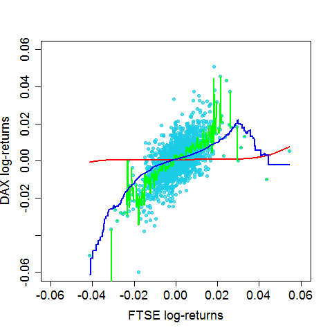

[](http://quantlet.de/index.php?p=info)

## [](http://quantlet.de/) **BCS_UniformKernel** [](http://quantlet.de/d3/ia)

```yaml

Name of Quantlet : BCS_UniformKernel

Published in : Basic Elements of Computational Statistics

Description : 'Multiple unform kernel regressions for DAX log-returns on FTSE log-returns. The
bandwidth is alternated to see the effect of the bandwidth for the regression results. The
smootheness of the regression line increases with a higher bandwidth. This causes a smaller bias
but a higher variance.'

Keywords : 'kernel,regression,DAX,FTSE,log-returns,estimation,plot, nonparametric,univariate
nonparametric regression,uniform bandwidth,different bandwidths'

See also : BCS_KernelSmoother

Author : [New] Christoph Schult

Submitted : 2016-01-28, Christoph Schult

Output : 'One plot for multiple kernel regressions of the DAX log-returns on FTSE log-returns.
Different regression lines correspond to different bandwiths.'

```




```r
# load necessary packages
require(datasets)
require(class)
require(grDevices)
require(lattice)

# define log-returns for the DAX and FTSE indeces
r.dax = diff(log(EuStockMarkets[, 1]))
r.ftse = diff(log(EuStockMarkets[, 4]))

# estimated log-returns for the DAX index for different bandwidths
np.reg.b1 = ksmooth(r.ftse, r.dax, kernel = "box", bandwidth = 0.1)  # h = 0.1
np.reg.b2 = ksmooth(r.ftse, r.dax, kernel = "box", bandwidth = length(r.dax)^(-1))  # h = 1/n
np.reg.b3 = ksmooth(r.ftse, r.dax, kernel = "box", bandwidth = length(r.dax)^(-(1/2)))  # h = 1/n^0.5

# plot for the regression results
par(cex.axis = 1.5, cex.lab = 1.5, pch = 19, cex = 1)  # graphical parameters
plot(r.ftse, r.dax, xlim = c(-0.06, 0.06), ylim = c(-0.06, 0.06), xlab = "FTSE log-returns", ylab = "DAX log-returns", 
    col = rgb(0.1, 0.8, 0.9, alpha = 0.7))
lines(np.reg.b1, col = "red", lwd = 2)  # regression line with h = 0.1
lines(np.reg.b2, col = "green", lwd = 2)  # regression line with h = 1/n
lines(np.reg.b3, col = "blue", lwd = 2)  # regression line with h = 1/n^0.5
```
