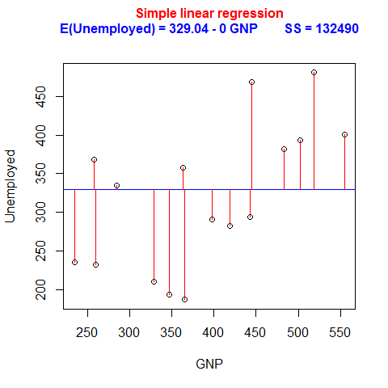

[](http://quantlet.de/)

## [](http://quantlet.de/) **BCS_UnivariateRegression** [](http://quantlet.de/)

```yaml


Name of Quantlet:           'BCS_UnivariateRegression'

Published in:               'Basic Elements of Computational Statistics'

Description:                'Interactive scatterplot for a univariate regression of
                             unemployment on GNP. The data comes from the longley dataset
                             and is a time series. It is possible to include and exclude the
                             regression line and residuals.'

Keywords:                   'rgl, regression, univariate regression, plot, continuous,
                             time series, plot, scatterplot'

Author:                      Polina Marchenko

Submitted:                  '2016-01-28, Christoph Schult'


Output:                     'An interactive time series plot for the longley dataset.'

```



### R Code
```r

# Regression with one covariate
data(longley)  # load longley dataset
attach(longley)  # attach the longley dataset
rp.regression(GNP, Unemployed, line.showing = T, panel.plot = F)
```

automatically created on 2023-03-27