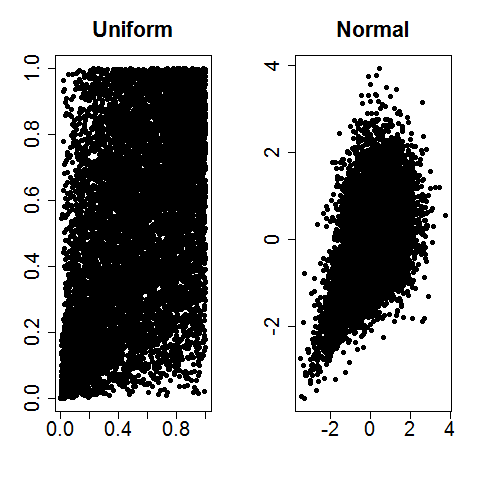

[](http://quantlet.de/index.php?p=info)

## [](http://quantlet.de/) **BCS_claytonMC** [](http://quantlet.de/d3/ia)

```yaml

Name of Quantlet : BCS_claytonMC

Published in : Basic Elements of Computational Statistics

Description : 'Plots two pseudo random variables with (1.) uniform distribution and (2.) N(0,1)
distribution with clayton (theta=0.79) dependence structure.'

Keywords : random number generation, uniform, Clayton, copula, uniform distribution, plot

See also : 'SFEClayGumbGauss, SFEclaytonMC, SFEclaytonSIM2pvt, SFEdynCop, SFEestGARCH, SFEfrechet,
SFEgausscop, SFEgumbelSIM2ptv, SFEplotCop, SFEresDens, SFEstaticCop, SFEtcop, SFEtMC'

Author : Ostap Okhrin

Submitted : 2016-01-28, Christoph Schult

Inputs : theta - dependence parameter

Output : 'Monte Carlo sample of 10.000 realizations of pseudo random variable with uniform
marginals in [0,1] and with standard normal marginals with dependence structure in both cases given
by Clayton copula.'

Example : Example is produced for theta = 0.79 and normal and uniform marginal distributions.

```




```r
# Close windows
graphics.off()

# Set up graphic space
par(mfrow = c(1, 2), cex = 0.7, cex.axis = 1.8, cex.main = 2)

# set working directory and load library setwd('C:\\...')
library(copula)
library(lattice)

theta = 1  #Set theta [0,1]

# variables uniformly distributed:
uniclayMVD <- mvdc(claytonCopula(theta), margins = c("unif", "unif"), paramMargins = list(list(min = 0, max = 1), list(min = 0, 
    max = 1)))
uniclay <- rMvdc(uniclayMVD, n = 10000)

plot(uniclay, xlab = "", ylab = "", pch = 19, main = "Uniform")


# variables standard normally distributed:
normclayMVD <- mvdc(claytonCopula(theta), margins = c("norm", "norm"), paramMargins = list(list(mean = 0, sd = 1), list(mean = 0, 
    sd = 1)))
normclay <- rMvdc(normclayMVD, n = 10000)

plot(normclay, xlab = "", ylab = "", pch = 19, main = "Normal")
```
