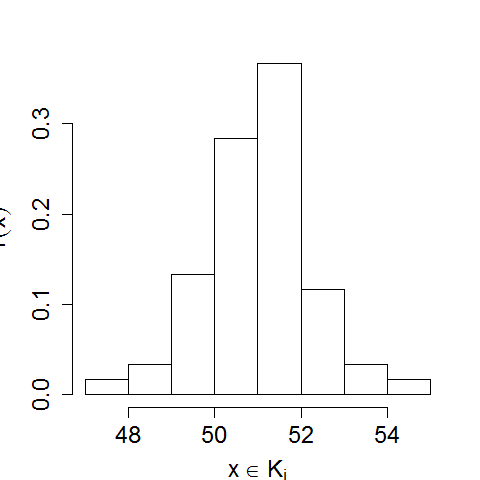

[](http://quantlet.de/)

## [](http://quantlet.de/) **BCS_hist1** [](http://quantlet.de/)

```yaml


Name of Quantlet:              'BCS_hist1'
Published in:                  'Basic Elements of Computational Statistics'

Description:                   'Histogram with default choice of grids based on R example data
                                nhtemp. Histograms are commonly used to visualize data frequencies of
                                continous variables.'

Keywords:                      'histogram, graphical, visualization, frequencies, data, grid'

Author[New]:                    Gunawan

Submitted:                     '2016-01-28, Christoph Schult'

Output:                        'Histogram of nhtemp in .pdf format.'

```



### R Code
```r

# setting up the axis label size and margin (bottom, left, top, right)
par(cex.lab = 1.5, mai = c(b = 1, l = 1, t = 0.7, r = 0.5))
# histogram with relative frequencies
hist(nhtemp, freq = F, main = "", ylab = expression(hat(f)(x)), xlab = expression(x %in% K[i]))
```

automatically created on 2023-03-27