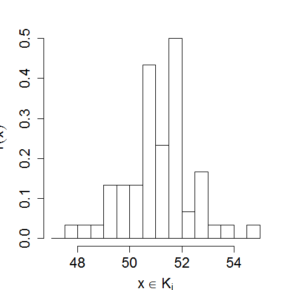

[](http://quantlet.de/)

## [](http://quantlet.de/) **BCS_hist2** [](http://quantlet.de/)

```yaml

Name of Quantlet : BCS_hist2

Published in : Basic Elements of Computational Statistics

Description : 'Histogram of R example data nhtemp with manual choice of grids. A manual choice of
grid is necessary, for example, for small samples, since R's default way of calculation is based on
the Sturges formula, which performs poorly for n < 30. Histograms are commonly used to visualize
data frequencies of continous variables.'

Keywords : histogram, plot, visualization, grid, frequencies, data

See also : BCS_BarGraphs, BCS_pie, BCS_hist1, BCS_Boxplot, BCS_Boxplot2

Author[New] : Gunawan

Submitted : 2016-01-28, Christoph Schult

Output : Histogram of nhtemp in .pdf format.

```




### R Code:
```r
# setting up the axis label size and margin (bottom, left, top, right)
par(cex.lab = 1.5, mai = c(b = 1, l = 1, t = 0.7, r = 0.5))

# histogram with relative frequencies with manual setting of intervals
hist(nhtemp, freq = F, breaks = seq(from = 47, to = 55, by = 0.5), main = "", ylab = expression(hat(f)(x)), xlab = expression(x %in% 
    K[i]))
```
