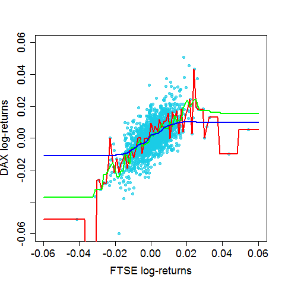

[](http://quantlet.de/index.php?p=info)

## [](http://quantlet.de/) **BCS_kNN** [](http://quantlet.de/d3/ia)

```yaml

Name of Quantlet : BCS_kNN

Published in : Basic Elements of Computational Statistics

Description : 'Multiple kNN regressions for DAX log-returns on FTSE log-returns. The selection of
nearest neighbours k is alternated to see the effect of k for the regression curves. The smoothness
of regression line is less smooth with a smaller k. This causes a smaller bias but a higher
variance.'

Keywords : 'kNN,regression,DAX,FTSE,log-returns,estimation,plot, nonparametric,univariate
nonparametric regression,uniform, nearest neighbours,different number of nearest neighbours'

See also : BCS_UniformKernel,BCS_GaussianKernel

Author[New] : Christoph Schult

Submitted : 2016-01-28, Christoph Schult

Output : 'One plot for multiple kNN regressions of the DAX log-returns on FTSE log-returns.
Different regression lines correspond to different k.'

```




```r
# load required packages
require(datasets)
require(class)
require(grDevices)
require(lattice)

# defien log-returns for DAX and FTSE
r.dax = diff(log(EuStockMarkets[, 1]))
r.ftse = diff(log(EuStockMarkets[, 4]))

# function for the kNN regression
knn.reg = function(x, xis, yis, k) {
    knn.reg = NA  # predefined vector for the estimated dax log-returns
    for (i in 1:length(x)) {
        distances = order(abs(x[i] - xis))  # distance of the actual point xis to the evaluated point x[i]
        knn.reg[i] = mean(yis[distances][1:k])  # computes average of the selected k-nearest neighbours to 
    }  # predict DAX log-returns.
    knn.reg
}

# 
knn.reg.k1 = function(x) knn.reg(x, r.ftse, r.dax, 1)  # regression function for k = 1
knn.reg.k2 = function(x) knn.reg(x, r.ftse, r.dax, 10)  # regression function for k = 10
knn.reg.k3 = function(x) knn.reg(x, r.ftse, r.dax, 250)  # regression function for k = 250

par(cex.axis = 1.5, cex.lab = 1.5, pch = 19, cex = 1)  # graphical parameters
plot(r.ftse, r.dax, xlim = c(-0.06, 0.06), ylim = c(-0.06, 0.06), xlab = "FTSE log-returns", ylab = "DAX log-returns", 
    col = rgb(0.1, 0.8, 0.9, alpha = 0.7), cex = 1)
plot(knn.reg.k1, add = TRUE, col = "red", xlim = c(-0.06, 0.06), ylim = c(-0.06, 0.06), type = "l", lwd = 2)
plot(knn.reg.k2, add = TRUE, col = "green", xlim = c(-0.06, 0.06), ylim = c(-0.06, 0.06), type = "l", lwd = 2)
plot(knn.reg.k3, add = TRUE, col = "blue", xlim = c(-0.06, 0.06), ylim = c(-0.06, 0.06), type = "l", lwd = 2)
```
