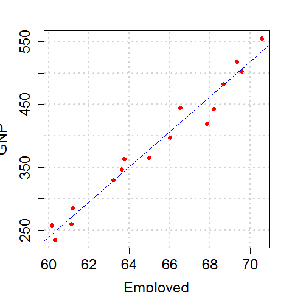

[](http://quantlet.de/)

## [](http://quantlet.de/) **BCS_linreg** [](http://quantlet.de/)

```yaml


Name of Quantlet:              'BCS_linreg'

Published in:                  'Basic Elements of Computational Statistics'

Description:                   'Plot of two variables from the R example dataset longley
                                (GNP, employed) including a regression line (OLS) and grid.'

Keywords:                      'plot, visualization, regression, linear, univariate'

Author[New]:                    Benjamin

Submitted:                     '2016-01-28, Christoph Schult'

Output:                        'Plot of regression in .pdf format.'

```



### R Code
```r

# In order to use the variable of the 'longley' data (available data set in R) directly use attach()
attach(longley)

# plotting 'Gross national Product' against the 'number of employed people' col=' ' specifies the color of the dots
# and pch specifies the dots
plot(Employed, GNP, col = "red", pch = 16)

# adding a least-square regression line to the plot; the function lm is used to calculate a linear model
abline(lm(GNP ~ Employed), col = "blue")

# using a grid ; specifying strength of grid with 'lwd= '
grid(lwd = 2)
```

automatically created on 2023-03-27