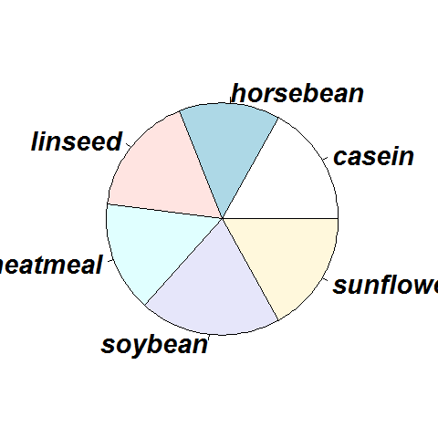

[](http://quantlet.de/)

## [](http://quantlet.de/) **BCS_pie** [](http://quantlet.de/)

```yaml


Name of Quantlet:              'BCS_pie'

Published in:                  'Basic Elements of Computational Statistics'

Description:                   'Pie Chart of chickwts$feed depicting the shares of different
                                feed types. It is a common technique for qualitative or discreet 
                                variables. Since the human brain does not distinguish as easily between
                                angles and shapes as it does between lengths, bar diagrams and bar plots
                                are preferred.'

Keywords:                      'plot, visualization, pie, chart, graphical visualization'

See also:                      'BCS_pie, BCS_hist2, BCS_hist1, 
                                BCS_Boxplot, BCS_Boxplot2'

Author[New]:                    Gunawan

Submitted:                     '2016-01-28, Christoph Schult'

Output:                        'Pie Chart of chickwts in .pdf format.'

```



### R Code
```r

# margins (bottom, left, top, right)
par(mai = c(b = 0.01, l = 1, t = 0.01, r = 0.9))

# Pie-Chart with axis text size=1.8
pie(table(chickwts$feed), cex = 1.8)
```

automatically created on 2023-03-27