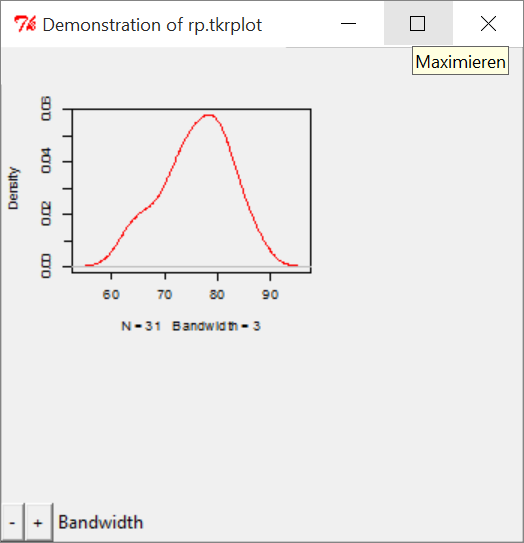

[](http://quantlet.de/index.php?p=info)

## [](http://quantlet.de/) **BCS_rp.tkrplot** [](http://quantlet.de/d3/ia)

```yaml

Name of Quantlet : BCS_rp.tkrplot

Published in : Basic Elements of Computational Statistics

Description : 'The rpanel package employs different graphical user interface (GUI) controls to
enable the immediate communication with the graphical output and provides dynamic graphics. The
rp.tkrplot function uses the tkrplot package and enables to place a plot and its control panel in a
single window. In this example a density plot with a control for altering the bandwidth is drawn.'

Keywords : rpanel,tkrplot,density,plot,bandwidth

See also : 'BCS_ControlDensityEstimate BCS_HistogramBoxplotOption BCS_UnivariateRegression
BCS_BivariateRegression BCS_NormalDensityFit'

Author : Polina Marchenko

Submitted : 2016-01-28, Christoph Schult

Output : Density plot with bandwidth control widget

```




```r
# Load tkrplot, tcltk and rpanel packages (have to be installed)
require(tkrplot)
require(tcltk)
require(rpanel)

# Load the trees data (included in R)
attach(trees)

# Define r to be range of variable Height
r = diff(range(Height))

if (interactive()) {
    # use the following code only in an interactive R session specify a function to be called by rp.tkrplot
    draw = function(panel) {
        plot(density(panel$y, panel$sp), col = "red", main = "")  # define color and title of plot
        panel
    }
    redraw <- function(panel) {
        # specify a function to be called if double button widget is used
        rp.tkrreplot(panel, density)  # replot the plot called 'density' in the window 'panel'
        panel
    }
    rpplot <- rp.control(title = "Demonstration of rp.tkrplot", y = Height, sp = r/8)  # variables controlled by control panel
    
    rp.tkrplot(rpplot, density, draw)  # specify the function to be called to draw the plot
    
    rp.doublebutton(rpplot, sp, 1.03, log = T, range = c(r/50, NA), title = "Bandwidth", action = redraw)  # call the function redraw if widget is used
}
```
