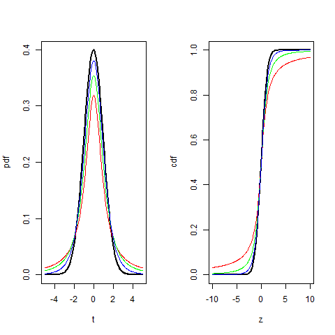

[](http://quantlet.de/)

## [](http://quantlet.de/) **BCS_tPdfCdf** [](http://quantlet.de/)

```yaml


Name of Quantlet:              BCS_tPdfCdf

Published in:                  'Basic Elements of Computational Statistics'

Description:                   'Stundent''s t-distribution is the ratio of a normal
                                distribution and a chisquare distribution. The t-distribution
                                is used for several statisitcal tests. The degrees of freedom
                                specify the moments of the distribution.'

Keywords:                      'statistics, continuous, square, normal, chisquare, root, test,
                                univariate, distribution, t-distribution, pdf, cdf, student'

See also:                      'BCS_StablePdfCdfSpecial, BCSExpPdfCdf, BCS_tPdfCdf,
                                BCS_NormPdfCdf, BCS_ChiPdfCdf, BCS_tQQplots
                                BCS_FPdfCdf, BCS_CauchyPdfCdf, BCS_StablePdfCdf'

Author:                         Ivan Vasylchenko, Benjamin Samulowski, Noa Tamir

Submitted:                     '2016-01-28, Christoph Schult'


Output:                        'Plots pdfs and cdfs for the t-distribution with different
                                degrees of freedom.'

```



### R Code
```r

par(mfrow = c(1, 2))
# t distributed variable
t = seq(-5, 5, length = 300)
df = c(1, 2, 5)  # degrees of freedom(df) for the t-distribution

# standard normal pdf (reference function)
plot(t, dnorm(t, 0, 1), xlab = "t", ylab = "pdf", type = "l", lwd = 2)
# df=1
lines(t, dt(t, df[1]), col = "red")
# df=2
lines(t, dt(t, df[2]), col = "green")
# df=5
lines(t, dt(t, df[3]), col = "blue")

# different range needed to illustrate the differences
t = seq(-10, 10, length = 300)
# cdf of normal
plot(t, pnorm(t, 0, 1), xlab = "z", ylab = "cdf", type = "l", lwd = 2)
# order of df as above
lines(t, pt(t, df[1]), col = "red")
lines(t, pt(t, df[2]), col = "green")
lines(t, pt(t, df[3]), col = "blue")
```

automatically created on 2023-03-27