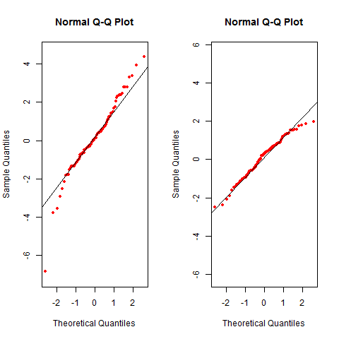

[](http://quantlet.de/index.php?p=info)

## [](http://quantlet.de/) **BCS_tQQplots** [](http://quantlet.de/d3/ia)

```yaml

Name of Quantlet : BCS_tQQplots

Published in : Basic Computational Statistics

Description : 'QQ plots compare empirical quantiles of a distribution with theoretical quantiles of
the standard normal distribution. If the degrees of freedom for the t-distribution tend to
infinity, the QQ plot is a 45 degree line. Quantiles of the t-distribution and normal distribution
are identical. The t-distribution converges to the normal distribution in infinite samples.'

Keywords : 'univariate,distribution,Student,plot,continuous,quantile,
normal,chisquare,t-distribution,test,QQ,asymptotic,student'

See also : BCS_ChiNormApprox, BCS_NormPdfCdf, BCS_ChiPdfCdf, BCS_tPdfCdf

Author : Ivan Vasylchenko, Benjamin Samulowski, Noa Tamir

Submitted : 2016-01-28, Christoph Schult

Output : QQ plots for the t distribution with different degrees of freedom.

```




```r
par(mfrow = c(1, 2))

# create random sample which is t-distributed
x = rt(100, df = 3)
# quantiles of t with 3 degrees of freedom
qqnorm(x, col = "red", pch = 20, asp = 1)
# line of perfect fit
qqline(x)

# create random sample which is t-distributed
y = rt(100, df = 100)
# quantiles of t with 100 degrees of freedom
qqnorm(y, col = "red", pch = 20, asp = 1)
# line of perfect fit
qqline(y)

```
